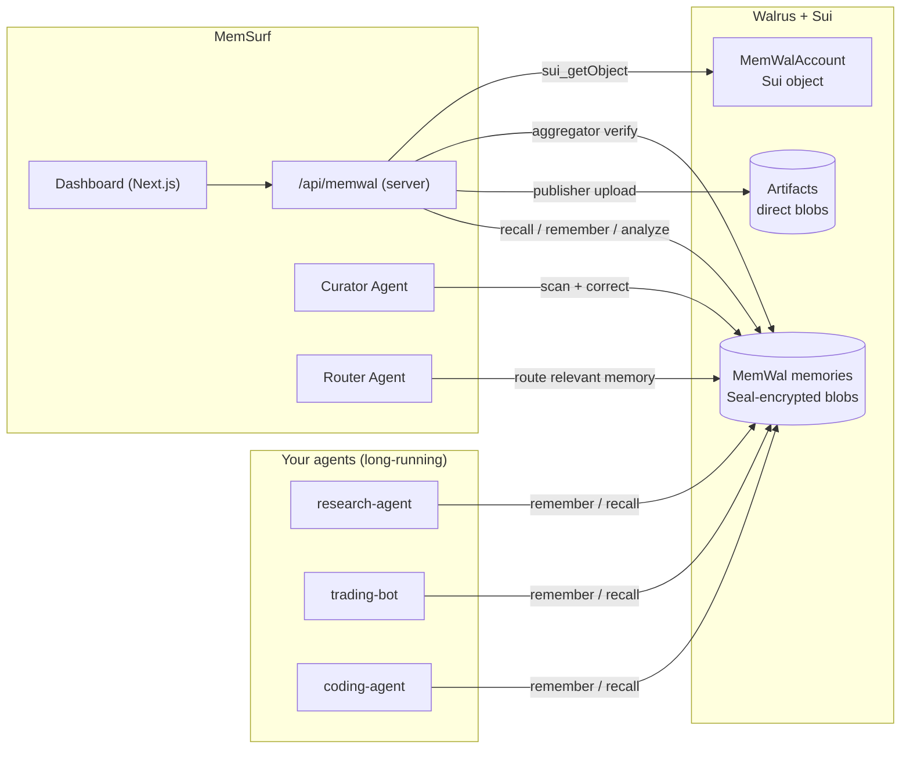

<div align="center">


# MemSurf

**The command center for your AI agents' memory on Walrus.**
Inspect it, search it, **verify** it, **route** it between agents, and keep it clean —
the missing layer that makes [Walrus Memory (MemWal)](https://docs.wal.app/walrus-memory/getting-started/what-is-memwal) adoptable.

[**Live demo →**](https://memsurf.vercel.app) · [**Watch the demo**](#) · [Features](#features) · [How it works](#how-it-works) · [Walrus stack](#built-on-the-walrus-stack) · [Why it fits](#why-it-fits-the-walrus-track)


</div>

---

## 👩‍⚖️ For judges — evaluate in 2 minutes

No account, no setup. Everything below runs against **real Walrus testnet data** — served from a
**MemWal (Walrus Memory) account I prepared specifically for this MemSurf demo**, so you can explore
real on-chain data with no account of your own. (To use your *own* agents instead, bring a delegate
key — see [Quickstart](#quickstart).)

1. Open **[memsurf.vercel.app](https://memsurf.vercel.app)** → **Launch App** → **“Explore the demo (no account needed)”**.
2. **Discover** — real memories, surfaced from Walrus. Switch the namespace (top bar) between `coding-agent`, `research-agent`, `trading-bot` — *example agents that stand in for your own; MemSurf is the layer that manages them, not the agents themselves.*
3. **Verify** (button on any memory) — MemSurf re-fetches the blob from the public Walrus aggregator: it exists, is Seal-encrypted, content-addressed. *Independent proof it's on Walrus.*
4. **Curator Agent** → **Run** — autonomously flags a duplicate, a vague memory, and missing-topic gaps.
5. **Router Agent** — `research-agent` → `trading-bot` → **Run** → **Route**. Or tick **Two-way + Go Live** to watch it route relevant memories between agents autonomously.
6. **On-chain chip** (top-right) — the account is a real `MemWalAccount` Move object on Sui testnet, and
   MemSurf's **own `memsurf::routing` contract** is published there too (the chip links both to the explorer).
   When you Route, the decision is **anchored on Sui** — the success line links to the live transaction.

> Want to see the agents in motion? `node scripts/agents-demo.mjs` runs a live
> research → router → trading handoff, all persisted on Walrus.

**Uses the full stack:** MemWal · Walrus (direct read + write) · Seal · Sui.

---

## Positioning — read this first

**MemSurf is not an agent. It's the layer that manages agent memory** on Walrus —
inspect, verify, curate, route.

- The **autonomous, long-running agents** in this submission are MemSurf's own
  **Curator Agent** (continuously scans memory for duplicates/gaps and corrects
  forward) and **Router Agent** (watches agents and routes relevant knowledge
  between them, anchoring + messaging each decision — and the target side can
  **reject** a proposed memory with a reason (a single-round, reviewer-driven
  control in the UI), logged as its own counter-memory).
- `coding-agent` / `research-agent` / `trading-bot` are **example client
  namespaces** — stand-ins for *your* agents. They demonstrate what MemSurf
  manages; they are **not** the deliverable. Point MemSurf at your own agent's
  namespace and it works exactly the same.
- **MemSurf doesn't create memories — your agents do.** In normal use, memories
  are written **automatically** by the agents themselves as they use Walrus
  Memory (the MemWal SDK) — that's the main path. MemSurf then **reads, verifies,
  curates, and routes** that memory. The **Add Memory** screen is just a manual
  shortcut to write or seed a memory by hand (handy for testing — and what the
  demo video uses); it is *not* how memory normally gets in.

So: the deliverable is the **horizontal memory-management layer**, not any one
vertical agent.

---

## The problem

AI agents store memory, but that memory is a **black box**. A developer who gives an agent
[MemWal](https://docs.wal.app/walrus-memory) memory on Walrus can't easily *see* what the agent
remembers, *verify* it's really there, *spot* duplicates and gaps, or *move* a relevant memory
from one agent to another. Memory ends up **siloed per agent and invisible** — exactly the
"fragile, siloed memory setups" the Walrus track asks builders to move beyond.

## What MemSurf does

MemSurf is a **developer tool + agentic layer** on top of MemWal. Connect with a delegate key
(or click **Explore the demo**) and you can:

- **See** everything your agents remember on Walrus, across namespaces.
- **Verify** each memory independently — fetched straight from the public Walrus aggregator.
- **Curate** memory quality with an autonomous agent (duplicates, vague entries, gaps).
- **Route** the *relevant* memories from one agent to another with a second autonomous agent.
- **Store artifacts** (datasets, logs, reports) **directly on Walrus**.

It turns Walrus memory from a write-only black box into something **observable, verifiable, and shareable**.

## Features

| Feature | What it does | Walrus / MemWal usage |
|--|--|--|
| **Discover** | Surfaces an agent's memories (multi-query recall + dedupe — MemWal has no "list all") | `recall` |
| **Search** | Natural-language semantic search over an agent's memory | `recall` |
| **Add Memory** | Write a decision/fact straight to Walrus | `rememberAndWait` |
| **Capture** | Paste notes → MemWal's server-side LLM extracts facts → each stored as a memory | `analyze` |
| **Curator Agent** 🤖 | Autonomous memory hygiene: near-duplicates (cosine distance), vague entries (heuristic), gaps (category checklist) — flags + fills, never deletes | `recall` + `remember` |
| **Router Agent** 🔀 | Autonomously copies the memories from one agent that are *relevant* to another (semantic match to interests), gap-aware. **Anchors each decision on Sui**, **notifies the target via Sui Stack Messaging** (recorded on Walrus), and supports **reject-with-reason** — the target can decline a memory, logged as its own counter-memory | `recall` + `rememberBulk` + Sui + messaging |
| **Transfer** | One-click copy a memory across agents | `remember` |
| **Verify on Walrus** 🛡️ | Re-fetches the blob from the public Walrus aggregator → proves it exists, is Seal-encrypted, content-addressed | Walrus aggregator (direct) |
| **Artifacts** 📦 | Upload files directly to Walrus via the public publisher | Walrus publisher (direct) |
| **On-chain panel** | Reads the `MemWalAccount` object + MemSurf's own `memsurf::routing` package from Sui | Sui RPC |

## How it works



The browser talks to a small server route (`/api/memwal`) that wraps the MemWal SDK and Walrus's
public publisher/aggregator. The delegate key is used server-side and never shipped to the browser;
**demo mode** lets judges explore real Walrus data with no account.

### The agentic workflows

- **Curator Agent** — runs over an agent's memory, evaluates it (duplicate / vague / gap), and acts
  (adds corrective memory). Memory is immutable on Walrus, so it *corrects forward*, never deletes.
- **Router Agent** — given a target agent's interests, recalls the *relevant* memories from a source
  agent and copies them across, logging each routing decision as its own memory in `memory-router`.
  Each handoff also **notifies the target** (Sui Stack Messaging-style notification, filed on Walrus
  in `inbox:<target>`), and the target can **reject** a proposed memory with a reason — a single-round
  negotiation where the rejection is stored as the target's own counter-memory rather than silently dropped.
- **Closed autonomous loop** (`scripts/agents-demo.mjs`) — a complete agentic workflow:
  `research-agent` records a finding → Router routes it (and **anchors the routing on Sui**) →
  `trading-bot` reads it, acts, and measures a result → Router routes that result **back** to
  `research-agent`, which learns from the downstream outcome. No re-prompting; every memory is on
  Walrus, every routing decision is anchored on-chain.

## Built on the Walrus stack

- **MemWal** — the core memory layer. Every memory op (`remember`, `recall`, `analyze`, `restore`,
  `rememberBulk`) goes through the MemWal SDK.
- **Walrus** — used **directly**, not only via MemWal: *Verify* reads blobs from the public
  Walrus **aggregator**; *Artifacts* writes files via the public Walrus **publisher**.
- **Seal** — every memory is end-to-end **Seal-encrypted** before it reaches Walrus (via MemWal).
  *Verify* surfaces this: the bytes you fetch from the aggregator are ciphertext; only the delegate
  key can decrypt.
- **Sui** — two ways. (1) The `MemWalAccount` is a real **Move object** on Sui testnet
  (`0xcf6ad755…::account::MemWalAccount`); delegate keys are registered on-chain, and the on-chain
  panel reads it straight from a Sui full node. (2) MemSurf publishes its **own Move package**,
  [`memsurf::routing`](move/DEPLOYMENT.md) (`0xf13a3c58…`), with a shared `RoutingRegistry` —
  every time the Router moves memory between agents it **anchors the decision on-chain**
  (`anchor_routing`, emitting a tamper-evident `RoutingAnchored` event).
- **Framework adapter** — `MemWalChatMemory`
  ([`src/adapters/memwal-langchain.ts`](src/adapters/memwal-langchain.ts)) exposes Walrus memory
  through a LangChain-style interface (`loadMemoryVariables` / `saveContext`), so an agent built on
  an existing framework can use MemWal as its memory layer **outside** the MemSurf UI. Runnable
  example: [`examples/langchain-adapter/`](examples/langchain-adapter/).

## Why it fits the Walrus track

> *Build AI agents and agentic workflows powered by Walrus as a verifiable data and memory layer.*

| Track ask | MemSurf |
|--|--|
| Interfaces/dev tools to **inspect, debug, manage** agent memory on Walrus | Core of the product |
| **Cross-agent memory sharing** (read/write the same context on Walrus) | Router Agent + Transfer |
| **Long-running agents** tracking state over time | research / trading / coding agents + handoff demo |
| **Persistent data/file access** using Walrus directly | Artifacts (publisher) + Verify (aggregator) |
| **Make MemWal adoptable** for developers | The entire premise |
| Long-term, **verifiable** memory | Verify-on-Walrus + Seal + content-addressing |

## Verifiable & on-chain

Every memory card links to its **Walrus blob** (Walruscan) and can be **independently verified** —
MemSurf re-fetches the blob from the public aggregator and shows its size, that it's Seal-encrypted,
and that its `blob_id` is **content-addressed** (the text can't change without changing the id).
The account itself is a `MemWalAccount` Move object viewable on
[SuiVision](https://testnet.suivision.xyz) / [Suiscan](https://suiscan.xyz/testnet).

Beyond reading, MemSurf **writes** to Sui: its own `memsurf::routing` package
([`0xf13a3c58…`](https://suiscan.xyz/testnet/object/0xf13a3c58afab129da743cb1fb1f3804cf08f6b172ba699cee8aeeceb9e5c788a))
anchors every routing decision as a permanent, ordered `RoutingAnchored` event — see
[`move/DEPLOYMENT.md`](move/DEPLOYMENT.md) for the package, registry, and live transactions.

## Quickstart

**Just want to look?** Open the [live demo](https://memsurf.vercel.app) → **Connect** → **Explore the demo**.

**Use your own agent's memory:**

1. Create an account + delegate key at the [MemWal Playground (testnet)](https://staging.memory.walrus.xyz).
2. Open [memsurf.vercel.app/connect](https://memsurf.vercel.app/connect), paste your delegate key + account id.
3. Run it locally:
   ```bash
   git clone https://github.com/VincenImanuell/MemSurf && cd MemSurf
   npm install
   # .env.local — MEMWAL_KEY, MEMWAL_ACCOUNT_ID, MEMWAL_SERVER_URL=https://relayer-staging.memory.walrus.xyz
   node scripts/seed.mjs          # seed sample agent memories
   node scripts/agents-demo.mjs   # run the multi-agent handoff pipeline
   npm run dev
   ```

## Roadmap

Honest about what's *not* built yet — future work, not claimed:

- **Cryptographic provenance** (per-memory signing + browser re-verification)
- **Direct Seal access policies** (own Move policy for shared, permissioned memory)
- **Cross-user** memory sharing (scoped delegate keys)
- **Real-time** sync + more framework adapters (Mastra / agent-framework hooks — LangChain-style adapter already shipped, see above)
- **Multi-round negotiation** (the Router now supports single-round reject-with-reason — see below; multi-round back-and-forth is next)

## Tech stack

Next.js 16 · React 19 · Tailwind v4 · Framer Motion · Lenis · `@mysten-incubation/memwal` ·
Walrus testnet publisher/aggregator · Sui testnet RPC · Vercel.

---

<div align="center">
Built for <b>Sui Overflow 2026 — Walrus Track</b>. Powered by
<a href="https://www.walrus.xyz/">Walrus</a> & <a href="https://sui.io">Sui</a>.
</div>
