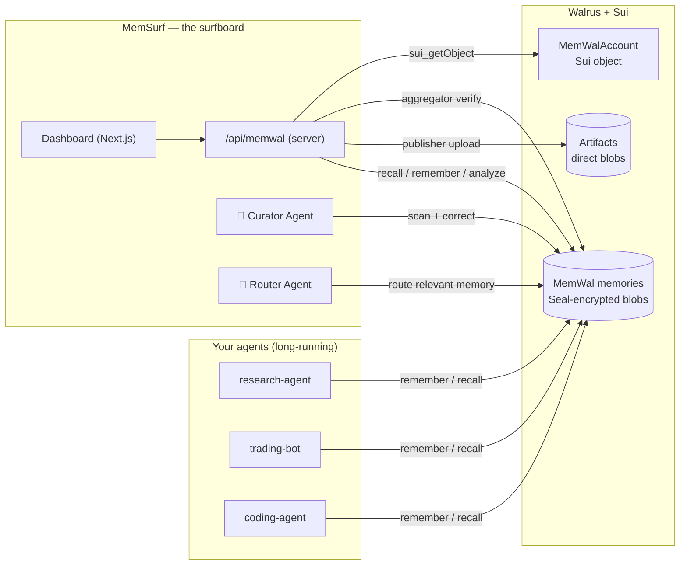

<div align="center">


# MemSurf

**See your AI agents' memory on Walrus — then let MemSurf's own agents ride it.**
A dashboard to inspect, search and **verify** every memory your agents store on
[Walrus Memory (MemWal)](https://docs.wal.app/walrus-memory/getting-started/what-is-memwal) —
plus two autonomous agents, **Curator** and **Router**, that keep that memory clean and
flowing so your agents never drown in their own ocean of memory.

[**Live demo →**](https://memsurf.vercel.app) · [**▶ Watch the 4-min demo**](https://youtu.be/tkxAFc3WmV4) · [Features](#features) · [The agents](#the-agents) · [How it works](#how-it-works) · [Walrus stack](#built-on-the-walrus-stack) · [Why it fits](#why-it-fits-the-walrus-track)


</div>

---

## 👩‍⚖️ For judges — evaluate in 2 minutes

**▶ [Watch the 4-minute demo video](https://youtu.be/tkxAFc3WmV4)** · **[Try it live → memsurf.vercel.app](https://memsurf.vercel.app)**

No account, no setup. Everything below runs against **real Walrus testnet data** — served from a
**MemWal (Walrus Memory) account I prepared specifically for this MemSurf demo**, so you can explore
real on-chain data with no account of your own. (To point MemSurf at your *own* agents instead, bring
a delegate key — see [Quickstart](#quickstart).)

1. Open **[memsurf.vercel.app](https://memsurf.vercel.app)** → **Launch App** → **“Explore the demo (no account needed)”**.
2. **Discover** — real memories, surfaced from Walrus. Switch the namespace (top bar) between `coding-agent`, `research-agent`, `trading-bot` — *these are example **client** agents standing in for **your** agents (the ones whose memory MemSurf manages). They are not MemSurf's own agents — those are the **Curator** and **Router** you'll run in steps 4–5.*
3. **Verify** (button on any memory) — MemSurf re-fetches the blob from the public Walrus aggregator: it exists, is Seal-encrypted, content-addressed. *Independent proof it's on Walrus.*
4. **Curator Agent** → **Run** — autonomously flags a duplicate, a vague memory, and missing-topic gaps, then corrects forward.
5. **Router Agent** — `research-agent` → `trading-bot` → **Run** → **Route**. Or tick **Two-way + Go Live** to watch it route relevant memories between agents autonomously.
6. **On-chain chip** (top-right) — the account is a real `MemWalAccount` Move object on Sui testnet, and
   MemSurf's **own `memsurf::routing` contract** is published there too (the chip links both to the explorer).
   When you Route, the decision is **anchored on Sui** — the success line links to the live transaction.

> Want to see the agents in motion? `node scripts/agents-demo.mjs` runs a live
> research → router → trading handoff, all persisted on Walrus.

**Uses the full stack:** MemWal · Walrus (direct read + write) · Seal · Sui.

---

## Contents

- [The problem](#the-problem) — why agent memory is broken
- [What MemSurf is](#what-memsurf-is) — the surfboard
- [Why MemSurf — claims & justification](#why-memsurf--claims--justification) — every claim, with sources and honest notes
- [The agents](#the-agents) — Curator & Router
- [Features](#features)
- [How it works](#how-it-works)
- [Built on the Walrus stack](#built-on-the-walrus-stack)
- [Why it fits the Walrus track](#why-it-fits-the-walrus-track)
- [Verifiable & on-chain](#verifiable--on-chain)
- [Quickstart](#quickstart) · [Roadmap](#roadmap) · [Tech stack](#tech-stack)

---

## The problem

**AI agents are exploding — but their memory is broken.** Gartner reports **60% of organizations**
are already piloting or scaling AI agents, and projects **70% of enterprises will deploy agentic AI
by 2029** (up from under 5% in 2025), naming agents the **#1 CIO investment area**. Underneath that
wave sits an unsolved foundation: **memory**.

- A large-scale arXiv study of real agent-development challenges finds **memory / embeddings /
  vector-store work** — giving agents working memory across steps, tools, and sessions — is one of
  the **largest clusters of developer pain (~17%, the second-biggest area)**.
- Gartner notes today's agents are largely limited to **short-term, session-only memory**.

So memory matters. But the harder truth is *what* stays thin. **Storage is already crowded** —
ChromaDB, Pinecone, FAISS, Weaviate, Mem0, Zep — and it overwhelmingly solves one half: **store +
retrieve**. What's still missing is everything *around* the memory:

| The gap | What agents can't do today |
|--|--|
| **Observability** | *See* what an agent actually remembers — it's a write-only black box |
| **Routing** | *Move* the relevant memory from one agent to another — memory is siloed per agent |
| **Verifiability** | *Prove* a memory is really stored, encrypted, and untampered |
| **Hygiene** | *Clean* duplicates, vague entries, and gaps that pile up over time |

That's the ocean an agent drowns in: memory that's invisible, siloed, unverifiable, and messy —
exactly the *"fragile, siloed memory setups"* the Walrus track asks builders to move beyond.

> **Honest framing.** Memory is **not** the single #1 challenge in the arXiv study (dependency/version
> conflicts, ~21%, edges it out) — it's *one of the foundations*, not "the biggest." And the gaps above
> are **under-served and hard**, not *untouched*: the storage space is busy and SentinelMem (a rival)
> goes deeper on cryptographic verification. MemSurf's bet is the **horizontal** lane — observability +
> routing + verifiability for *any* agent — not out-teching one vertical.

## What MemSurf is

An agent that stores memory on Walrus is **flying blind**: its memory is a write-only black box, it
piles up duplicates and gaps, and it can't share what it learns with the next agent. The memory keeps
rising like an ocean — and the agent **drowns** in it.

**MemSurf is the surfboard.** Two halves, one idea — *ride the memory instead of sinking under it:*

- **A dashboard** to *see* the ocean — inspect, search, and independently **verify** every memory your
  agents hold on Walrus, across namespaces.
- **Two autonomous agents** that *ride* it for you:
  - 🤖 **Curator** — continuously scans an agent's memory and keeps it clean (duplicates, vague entries, gaps), correcting forward.
  - 🔀 **Router** — watches your agents and moves the *relevant* knowledge between them, anchoring every decision on Sui and notifying the receiving agent.

So MemSurf isn't *just* a dashboard. It's a dashboard **plus working agents** — the missing layer that
makes [Walrus Memory (MemWal)](https://docs.wal.app/walrus-memory) actually adoptable.

> ### ⚠️ What is — and isn't — the submission
>
> **The submission is MemSurf — the layer.** `research-agent`, `trading-bot`, and `coding-agent` are
> **NOT** part of what I built or what I'm submitting. They are **my own example agents** — sample
> client agents I set up purely as **input/test data** so you can *watch* MemSurf work on something
> real. Think of them as the *waves*; **MemSurf is the surfboard** — the only thing being judged.
>
> Swap them for **your** agents (any namespace on MemWal/Walrus) and MemSurf behaves identically. The
> example agents are interchangeable demo material; **MemSurf is the deliverable.**

> **Honest scope.** MemSurf's **own** agents are **Curator** and **Router** — **memory-driven**
> agents that *perceive* (recall + embeddings), *decide* (semantic scoring, gap checks), and *act*
> (remember / route / anchor) over Walrus memory, with no human in the loop. They are **not** LLM
> chatbots. (`coding-agent` / `research-agent` / `trading-bot`, by contrast, are the **example client
> agents** described in the box above — the *input*, not the product.)

---

## Why MemSurf — claims & justification

Every claim MemSurf makes, mapped to its supporting evidence — with an **honest note** on each row so
a technical judge can see exactly where the claim is strong and where it's a fair extrapolation. The
strength of this case is its honesty: the rows marked *"don't overclaim"* are where MemSurf stays
defensible instead of fragile.

| # | Claim / feature | Justification (source) | Honest note |
|--|--|--|--|
| 1 | Agent memory is a 2026 foundational problem | arXiv: embeddings/vector store give agents working memory across steps, tools, sessions (~17%, 2nd-largest cluster). Gartner: agents limited to short-term, session-only memory | Memory isn't the #1 challenge in the paper (dependency conflicts ~21% is). Say *"a foundation,"* not *"the biggest"* |
| 2 | The agent market is exploding → memory tooling is timely | Gartner: 60% of orgs piloting/scaling agents; 70% of enterprises deploying agentic AI by 2029 (from <5% in 2025); agents = #1 CIO investment | Market context (Real-World 50%), not direct proof MemSurf is needed. Frame as *"the wave MemSurf serves"* |
| 3 | Storage is crowded — this isn't empty space | arXiv: ChromaDB 9.6%, LlamaIndex 4.1%, FAISS 3.8%, Pinecone 2.6%, Weaviate. Market: Mem0, Zep, Cognee | A *strength* of the framing: admit it's crowded, then differentiate. Never claim *"no competitors"* |
| 4 | The market focuses on store + retrieve; observability/routing lag | arXiv Topic-2 sub-topics are mostly store/retrieve (chunking 24%, persistence 14.5%, retrieval quality, similarity) | The paper *does* mention observability/routing — so *"under-served & hard,"* not *"nonexistent"* |
| 5 | **Observability** ("see it") is a real gap | arXiv: observability is the 2nd-most-common orchestration sub-challenge (~11.6%). Gartner: need observability of agent actions + audit logging | Gartner's point is IT-ops observability, not memory specifically. A market signal — don't force it to be *"about memory"* |
| 6 | **Routing** memory between agents ("move it") | arXiv: "Routing & Control Flow," "State Isolation & Merging," "Tool/Memory Binding" sub-topics | The unique differentiator — no rival has it. But the paper doesn't cover memory routing exactly; a fair extrapolation |
| 7 | **Verifiable & tamper-evident** ("verify it") | Gartner: need auditability, rollback, all actions safe & auditable, transparency in agent decisions | Gartner is about *action* auditability; MemSurf brings it to the *memory* layer via Walrus content-addressing + Sui anchoring — an honest connection, not an endorsement |
| 8 | **On-chain anchoring** (own Sui Move package) | Walrus Track spec: *"verifiable data & memory layer."* MemSurf deploys its own `memsurf::routing` | Load-bearing use of the stack, not a bolt-on. A real technical strength (20% of the rubric) |
| 9 | **Horizontal** — for any agent, not a niche | Cross-functional agent market (Gartner); framework fragmentation (Mem0's 21 integrations) demands an agnostic layer | The edge vs niche competitors. But framework adapters are still partly roadmap — adoption not fully proven |
| 10 | **No-setup, evaluate in 2 minutes** | Deployed demo on real testnet data, no account needed | A judging-experience edge (Product/UX 20%). Make sure the demo + video links actually work |
| 11 | **Agentic** (autonomous Curator + Router) | Closed-loop demo; correct-forward hygiene; autonomous routing + anchoring | Curator is heuristic, not LLM reasoning. Sell *"verified autonomy,"* not *"a smart agent"* |

> **Sources** — *(drop the exact links here before submitting)*
> [1] arXiv — study of LLM-agent development challenges (topic analysis of developer pain points). `<add link>`
> [2] Gartner — press release on AI-agent adoption (60% piloting / 70% by 2029 / #1 CIO investment). `<add link>`
> [3] Gartner — *Predicts 2026* (session-only memory; auditability of agent actions). `<add link>`
>
> Rows **1–5** are problem-statement ammunition (external sources — credible, screenshot-able).
> Rows **6–11** are solution justification (your own code/spec — show them in the demo, not on a research slide).

---

## The agents

These are the heart of MemSurf — autonomous, long-running, and built **on top of** Walrus memory.

### 🤖 Curator Agent — keeps memory clean

Runs over an agent's whole memory and acts on what it finds:

- **Near-duplicates** — low cosine distance between memories (e.g. a JWT pair at distance `0.41`).
- **Vague entries** — heuristic on length / word count (catches a memory that's just `"noted"`).
- **Knowledge gaps** — a category checklist recalled one by one; an empty/distant category is a gap.

Memory on Walrus is **immutable**, so the Curator never deletes — it **corrects forward**, adding a
sharper memory that out-ranks the stale one in semantic search. Every action is previewed for you first.

### 🔀 Router Agent — keeps memory flowing

Given a target agent's interests, it recalls the memories from a *source* agent that are genuinely
**relevant** and routes them across — turning siloed, per-agent memory into shared knowledge:

- **Relevance-scored** — semantic match against the target's interest profile, with a percentage per candidate.
- **Gap-aware** (`novelOnly`, default on) — only routes what the target *doesn't already know* (novelty distance > 0.3), so it never spams duplicates.
- **Anchored on Sui** — each routing decision is written to MemSurf's own `memsurf::routing` Move package as a tamper-evident `RoutingAnchored` event.
- **Notifies the target** — files an inbox notification on Walrus (`inbox:<target>`), and the target can **reject** a proposed memory with a reason — a single-round, reviewer-driven control, logged as the target's own counter-memory rather than silently dropped.
- **Two-way · Go Live** — flip a toggle and the Router runs on an interval, routing fresh, novel memories **both directions** autonomously while the tab is open.

### 🔁 The closed loop

`scripts/agents-demo.mjs` chains both agents into one autonomous workflow, no re-prompting:

> `research-agent` records a finding → **Router** routes it (**anchored on Sui**) →
> `trading-bot` reads it, acts, and measures a result → **Router** routes that result **back** →
> `research-agent` learns from the downstream outcome.

Every memory lives on Walrus; every routing decision is anchored on-chain.

---

## Features

| Feature | What it does | Walrus / MemWal usage |
|--|--|--|
| **Curator Agent** 🤖 | Autonomous memory hygiene: near-duplicates (cosine distance), vague entries (heuristic), gaps (category checklist) — flags + fills, never deletes | `recall` + `remember` |
| **Router Agent** 🔀 | Autonomously routes the memories from one agent that are *relevant* to another (semantic match, gap-aware). **Anchors each decision on Sui**, **notifies the target** on Walrus, supports **reject-with-reason** | `recall` + `rememberBulk` + Sui + messaging |
| **Discover** | Surfaces an agent's memories (multi-query recall + dedupe — MemWal has no "list all") | `recall` |
| **Search** | Natural-language semantic search over an agent's memory | `recall` |
| **Verify on Walrus** 🛡️ | Re-fetches the blob from the public Walrus aggregator → proves it exists, is Seal-encrypted, content-addressed | Walrus aggregator (direct) |
| **Capture** | Paste notes → MemWal's server-side LLM extracts facts → each stored as a memory | `analyze` |
| **Add Memory** | Write a decision/fact straight to Walrus (manual shortcut / seeding) | `rememberAndWait` |
| **Transfer** | One-click copy a single memory across agents | `remember` |
| **Artifacts** 📦 | Upload files directly to Walrus via the public publisher | Walrus publisher (direct) |
| **On-chain panel** | Reads the `MemWalAccount` object + MemSurf's own `memsurf::routing` package from Sui | Sui RPC |

> **MemSurf doesn't create your memories — your agents do.** In normal use, memories are written
> **automatically** by the agents themselves as they use Walrus Memory (the MemWal SDK). MemSurf then
> **sees, verifies, curates, and routes** that memory. **Add Memory** is just a manual shortcut for
> testing/seeding (and what the demo video uses) — not how memory normally gets in.

## How it works



The browser talks to a small server route (`/api/memwal`) that wraps the MemWal SDK and Walrus's
public publisher/aggregator. The delegate key is used server-side and never shipped to the browser;
**demo mode** lets judges explore real Walrus data with no account.

## Built on the Walrus stack

- **MemWal** — the core memory layer. Every memory op (`remember`, `recall`, `analyze`, `restore`,
  `rememberBulk`) goes through the MemWal SDK, and both agents are built on top of it.
- **Walrus** — used **directly**, not only via MemWal: *Verify* reads blobs from the public
  Walrus **aggregator**; *Artifacts* writes files via the public Walrus **publisher**.
- **Seal** — every memory is end-to-end **Seal-encrypted** before it reaches Walrus (via MemWal).
  *Verify* surfaces this: the bytes you fetch from the aggregator are ciphertext; only the delegate
  key can decrypt.
- **Sui** — two ways. (1) The `MemWalAccount` is a real **Move object** on Sui testnet
  (`0xcf6ad755…::account::MemWalAccount`); delegate keys are registered on-chain, and the on-chain
  panel reads it straight from a Sui full node. (2) MemSurf publishes its **own Move package**,
  [`memsurf::routing`](move/DEPLOYMENT.md) (`0xf13a3c58…`), with a shared `RoutingRegistry` —
  every time the Router moves memory between agents it **anchors the decision on-chain**
  (`anchor_routing`, emitting a tamper-evident `RoutingAnchored` event).
- **Framework adapter** — `MemWalChatMemory`
  ([`src/adapters/memwal-langchain.ts`](src/adapters/memwal-langchain.ts)) exposes Walrus memory
  through a LangChain-style interface (`loadMemoryVariables` / `saveContext`), so an agent built on
  an existing framework can use MemWal as its memory layer **outside** the MemSurf UI. Runnable
  example: [`examples/langchain-adapter/`](examples/langchain-adapter/).

## Why it fits the Walrus track

> *Build AI agents and agentic workflows powered by Walrus as a verifiable data and memory layer.*

| Track ask | MemSurf |
|--|--|
| **AI agents + agentic workflows** powered by Walrus | Curator + Router agents, plus the closed research→router→trading loop |
| **Cross-agent memory sharing** (read/write the same context on Walrus) | Router Agent + Transfer |
| **Long-running agents** tracking state over time | research / trading / coding agents + handoff demo |
| Interfaces/dev tools to **inspect, debug, manage** agent memory on Walrus | The dashboard half of MemSurf |
| **Persistent data/file access** using Walrus directly | Artifacts (publisher) + Verify (aggregator) |
| Long-term, **verifiable** memory | Verify-on-Walrus + Seal + content-addressing |
| **Make MemWal adoptable** for developers | The entire premise |

## Verifiable & on-chain

Every memory card links to its **Walrus blob** (Walruscan) and can be **independently verified** —
MemSurf re-fetches the blob from the public aggregator and shows its size, that it's Seal-encrypted,
and that its `blob_id` is **content-addressed** (the text can't change without changing the id).
The account itself is a `MemWalAccount` Move object viewable on
[SuiVision](https://testnet.suivision.xyz) / [Suiscan](https://suiscan.xyz/testnet).

Beyond reading, MemSurf **writes** to Sui: its own `memsurf::routing` package
([`0xf13a3c58…`](https://suiscan.xyz/testnet/object/0xf13a3c58afab129da743cb1fb1f3804cf08f6b172ba699cee8aeeceb9e5c788a))
anchors every routing decision as a permanent, ordered `RoutingAnchored` event — see
[`move/DEPLOYMENT.md`](move/DEPLOYMENT.md) for the package, registry, and live transactions.

## Quickstart

**Just want to look?** Open the [live demo](https://memsurf.vercel.app) → **Connect** → **Explore the demo**.

**Point MemSurf at your own agent's memory:**

1. Create an account + delegate key at the [MemWal Playground (testnet)](https://staging.memory.walrus.xyz).
2. Open [memsurf.vercel.app/connect](https://memsurf.vercel.app/connect), paste your delegate key + account id.
3. Run it locally:
   ```bash
   git clone https://github.com/VincenImanuell/MemSurf && cd MemSurf
   npm install
   # .env.local — MEMWAL_KEY, MEMWAL_ACCOUNT_ID, MEMWAL_SERVER_URL=https://relayer-staging.memory.walrus.xyz
   node scripts/seed.mjs          # seed sample agent memories
   node scripts/agents-demo.mjs   # run the multi-agent handoff pipeline
   npm run dev
   ```

## Roadmap

Honest about what's *not* built yet — future work, not claimed:

- **Cryptographic provenance** (per-memory signing + browser re-verification)
- **Direct Seal access policies** (own Move policy for shared, permissioned memory)
- **Cross-user** memory sharing (scoped delegate keys)
- **Real-time** sync + more framework adapters (Mastra / agent-framework hooks — LangChain-style adapter already shipped, see above)
- **Multi-round negotiation** (the Router now supports single-round reject-with-reason; multi-round back-and-forth is next)

## Tech stack

Next.js 16 · React 19 · Tailwind v4 · Framer Motion · Lenis · `@mysten-incubation/memwal` ·
Walrus testnet publisher/aggregator · Sui testnet RPC · Vercel.

---

<div align="center">
Built for <b>Sui Overflow 2026 — Walrus Track</b>. Powered by
<a href="https://www.walrus.xyz/">Walrus</a> & <a href="https://sui.io">Sui</a>.
</div>
